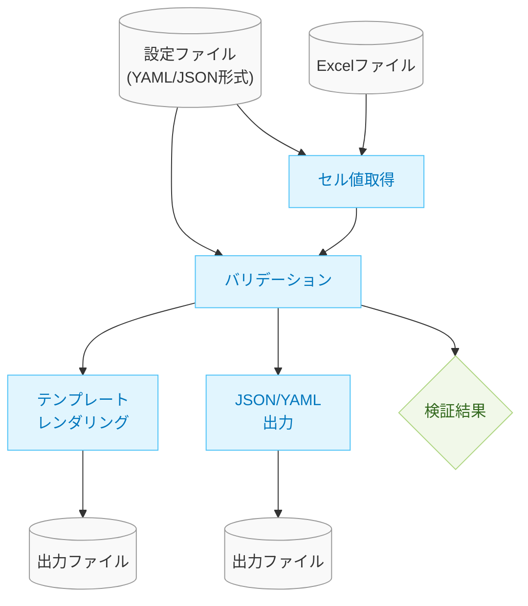

# バリデーションエンジンの設計ドキュメント

## 1. 概要

このドキュメントでは、xlsx-value-pickerプロジェクトにおけるバリデーション機能の設計について詳述します。バリデーション機能は、Excelファイル内のデータが特定のルールに合致しているかを検証し、問題があれば適切なエラーメッセージを返すことを目的としています。

## 2. バリデーション機能の全体アーキテクチャ

バリデーション機能は以下のコンポーネントで構成されます：



上記の図に示すように、設定ファイルはバリデーションルールの定義だけでなく、セル値取得のための参照先定義（フィールドとセル位置のマッピングなど）も含んでいるため、セル値取得コンポーネントへの入力としても機能します。

## 3. バリデーションルールの内部表現 (Pydanticモデル)

バリデーションルールは、設定ファイルの構造を反映したPydanticモデルとして表現します。これらのモデルは、設定データの構造定義と検証ロジックの実行の両方を担います。

### 3.1 基本的なデータクラス

```python
from abc import ABC, abstractmethod
from dataclasses import dataclass
from typing import Any, Dict, List, Optional, Union # Unionを追加

from pydantic import BaseModel # BaseModelを使用

@dataclass
class ValidationContext:
    # ... (変更なし) ...

@dataclass
class ValidationResult:
    # ... (変更なし) ...
```

### 3.2 ルール式モデル (Pydantic)

各種ルール式は、PydanticのBaseModelを継承したクラスとして定義します。これらのモデルは、設定ファイル内の式定義に対応し、`validate` メソッドによって実際の検証ロジックを実行します。

```python
class Expression(BaseModel, ABC):
    """すべてのルール式モデルの基底クラス"""

    @abstractmethod
    def validate(self, context: ValidationContext, error_message_template: str) -> ValidationResult:
        """ルール式の検証を行い結果を返す"""
        pass

class CompareExpression(Expression):
    """比較式モデル"""
    compare: Dict[str, Any]

    def validate(self, context: ValidationContext, error_message_template: str) -> ValidationResult:
        left_field = self.compare['left']
        operator = self.compare['operator']
        right_value = self.compare['right']
        left_value = context.get_field_value(left_field)

        # --- 比較ロジック ---
        is_valid = False
        try:
            if operator == "==":
                is_valid = (left_value == right_value)
            elif operator == "!=":
                is_valid = (left_value != right_value)
            # ... 他の演算子 ...
            # 型が異なる場合の比較など、詳細なロジックは実装時に検討
        except TypeError:
             # 比較不能な型の場合などはエラーとするか、仕様に応じてハンドリング
             pass # 例: is_valid = False のまま

        if is_valid:
            return ValidationResult(is_valid=True)
        else:
            # エラーメッセージを組み立てる (テンプレートを使用)
            msg = error_message_template.format(
                left_field=left_field,
                left_value=left_value,
                operator=operator,
                right_value=right_value
            )
            return ValidationResult(is_valid=False, error_message=msg, error_fields=[left_field])

class RequiredExpression(Expression):
    """必須項目式モデル"""
    field: str
    required: bool = True # スキーマ定義に合わせてフィールドを持つ

    def validate(self, context: ValidationContext, error_message_template: str) -> ValidationResult:
        target_field = self.field
        value = context.get_field_value(target_field)

        # --- 必須チェックロジック ---
        # required=True の場合のみチェック (Falseの場合は常にTrue)
        is_valid = not self.required or (value is not None and value != "") # 空文字列もNGとする例

        if is_valid:
            return ValidationResult(is_valid=True)
        else:
            msg = error_message_template.format(field=target_field)
            return ValidationResult(is_valid=False, error_message=msg, error_fields=[target_field])

# --- 複合ルール式モデル ---
# 前方参照とUnion型 (ExpressionType) を利用 (config_loader.py で定義済み想定)
# from .config_loader import ExpressionType

class AnyOfExpression(Expression):
    """いずれかの条件一致式モデル"""
    any_of: List['ExpressionType'] # 型ヒントにUnion型を使用

    def validate(self, context: ValidationContext, error_message_template: str) -> ValidationResult:
        # --- いずれか一つでも valid なら valid ---
        sub_results = [sub_expr.validate(context, "") for sub_expr in self.any_of] # サブルールのエラーメッセージは使わない

        if any(r.is_valid for r in sub_results):
            return ValidationResult(is_valid=True)
        else:
            # すべて失敗した場合、親のエラーメッセージを使用
            # 必要に応じて、失敗したサブルールの情報を集約することも検討
            all_error_fields = list(set(field for r in sub_results if r.error_fields for field in r.error_fields))
            msg = error_message_template # そのまま使うか、詳細情報を付加するか
            return ValidationResult(is_valid=False, error_message=msg, error_fields=all_error_fields)

# --- 他のルール式モデル (AllOfExpression, NotExpression, RegexMatchExpression, EnumExpression など) も同様に定義 ---
# class AllOfExpression(Expression): ...
# class NotExpression(Expression): ...

# --- ExpressionType Union ---
# config_loader.py などで定義される想定
# ExpressionType = Union[CompareExpression, RequiredExpression, AnyOfExpression, AllOfExpression, NotExpression, ...]

```

### 3.3 ルール全体モデル (Pydantic)

個々のルール定義全体を表すモデル。ルール名、適用する式モデル (`ExpressionType`)、エラーメッセージを持ちます。

```python
class RuleModel(BaseModel):
    """バリデーションルール全体を表すモデル"""
    name: str
    expression: 'ExpressionType' # Union型を使用
    error_message: str

    def validate(self, context: ValidationContext) -> ValidationResult:
        """
        ルールに定義された式モデルの検証を実行する
        """
        # expressionオブジェクトの検証メソッドを呼び出し、自身のエラーメッセージテンプレートを渡す
        result = self.expression.validate(context, self.error_message)
        # 必要に応じて、ルール名などの情報を結果に追加することも可能
        # if not result.is_valid:
        #    result.rule_name = self.name
        return result

# --- ConfigModel ---
# config_loader.py などで定義される想定
# class ConfigModel(BaseModel):
#    fields: Dict[str, str]
#    rules: List[RuleModel]
#    output: OutputFormat
```

## 4. ルール定義のパースとオブジェクト生成 (Pydantic中心)

設定ファイル（YAML/JSON）からバリデーションルールを読み込み、検証ロジックを持つPydanticモデルオブジェクトへ変換するプロセスは、Pydanticの機能を最大限に活用して行われます。

1.  **設定ファイルのパースとPydanticモデルへの変換 (Pydanticの自動処理):**
    *   設定ファイルパーサーが、YAMLまたはJSON形式の設定ファイルを読み込み、Pythonの辞書に変換します。
    *   Pydanticモデル (`ConfigModel`) を使用して、辞書データを検証し、型付けされたオブジェクトに変換します。この際、JSONスキーマに基づいた検証もPydanticのバリデーション機能や外部ライブラリ連携によって行われることが望ましいです。
    *   `ConfigModel` には、ルール定義 (`rules` フィールド) が含まれ、各ルールは `RuleModel` として表現されます。
    *   `RuleModel` 内のルール式 (`expression` フィールド) は、様々なバリデーション式に対応するPydanticモデル (`CompareExpression`, `RequiredExpression`, `AnyOfExpression` など) の **Union型 (`ExpressionType`)** として定義されます。
    *   これにより、Pydanticは設定データを読み込む際に、**自動的に適切な式モデルを判別し、インスタンス化**します。複雑なルール構造のパースと型解決の大部分は、この段階でPydanticによって処理されます。

2.  **検証ロジックの実行:**
    *   Pydanticによって生成された `ConfigModel` オブジェクトには、`rules` リスト内に `RuleModel` のインスタンスが含まれています。
    *   各 `RuleModel` インスタンス、およびその内部の `expression` (各式モデルインスタンス) は、セクション3で定義された `validate` メソッドを持っています。
    *   バリデーション実行エンジン (セクション5) は、これらの `validate` メソッドを直接呼び出すことで、設定に基づいた検証を実行します。
    *   **別途ファクトリを用意して実行可能なオブジェクトに変換する必要はありません。** Pydanticモデルがデータ構造定義と検証ロジック実行の両方を担います。

### 4.1 ルール定義スキーマ (YAML例)

```yaml
# 設定ファイル構造の例 (再掲)
fields:
  # ... (フィールド定義)

rules:  # バリデーションルール定義 (RuleModelリストに対応)
  - name: "その他選択時の自由記入必須"
    expression: # ExpressionTypeに対応 (Pydanticが自動判別)
      any_of: # AnyOfExpressionに対応
        - compare: # CompareExpressionに対応
            left: "animal_select"
            operator: "!="
            right: "その他"
        - required: # RequiredExpressionに対応 (※スキーマ定義は実装と整合させる必要あり)
            field: "animal_free_text"
            # required: true # requiredフィールドはモデル定義でデフォルトTrue想定
    error_message: "「{field}」は、「その他」を選んだ場合に必須です。" # メッセージテンプレート例

output:
  # ... (出力設定)
```
*(注: スキーマ定義と、それを解釈するPydanticモデルは整合している必要があります。)*

### 4.2 パーサー/モデルの責務 (Pydantic中心)

*   **パーサー/Pydanticモデル:** 設定ファイルを読み込み、スキーマに基づいて検証し、**型付けされたPydanticモデル (`ConfigModel`, `RuleModel`, `ExpressionType`) を生成する**責務を負います。**パースと型解決の大部分を自動化**し、さらに**検証ロジックの実行**も担います。

## 5. バリデーション実行エンジン

バリデーションエンジンは、Pydanticによって生成された設定モデル (`ConfigModel`) を利用して、以下の処理を行います：

1. Excelファイルからセル値を取得
2. バリデーションコンテキスト (`ValidationContext`) を構築
3. `ConfigModel` 内の各 `RuleModel` の `validate` メソッドを呼び出し、ルールを評価
4. バリデーション結果 (`ValidationResult`) を収集・整理

```python
# Pydanticモデル (config_loader.pyなどで定義済み想定)
# from .config_loader import ConfigModel, RuleModel

@dataclass
class ValidationEngine:
    # config_model: ConfigModel # エンジンがConfigModel全体を持つか、rulesだけ持つかは設計次第
    rules: List[RuleModel] # RuleModelのリストを持つ

    # --- コンストラクタなどで rules を受け取る ---
    # def __init__(self, config_model: ConfigModel):
    #     self.rules = config_model.rules

    def validate(self, excel_file: str, field_mapping: Dict[str, str]) -> List<ValidationResult>:
        # Excelから値を取得 (別途実装)
        cell_values = get_excel_values(excel_file, field_mapping)

        # コンテキストを構築
        context = ValidationContext(
            cell_values=cell_values,
            field_locations=field_mapping
        )

        # すべてのルールモデルの validate メソッドを評価
        results = []
        for rule in self.rules: # rule は RuleModel のインスタンス
            result = rule.validate(context) # RuleModelのvalidateを呼び出す
            if not result.is_valid:
                results.append(result)

        return results

# --- Excel値取得関数のイメージ ---
# def get_excel_values(excel_file: str, field_mapping: Dict[str, str]) -> Dict[str, Any]:
#    # ... excel_processor.py の機能を利用 ...
#    pass
```

## 6. CLI統合

バリデーション機能をCLIに統合します。既存のCLIオプションに加えて、以下の機能を追加します：

- バリデーションのみを実行するオプション
- バリデーション結果の出力形式指定
- バリデーションエラー時の動作カスタマイズ

```python
def main() -> None:
    parser = argparse.ArgumentParser(description="Excel値取得ツール")
    # 既存のオプション
    parser.add_argument("excel", nargs="?", help="Excelファイルパス（コマンドライン優先）")
    parser.add_argument("-c", "--config", default="config.yaml", help="設定ファイルパス")
    parser.add_argument("-o", "--output", help="出力ファイルパス（未指定時は標準出力）")
    
    # 新規追加オプション
    parser.add_argument("--validate-only", action="store_true", help="バリデーションのみを実行")
    parser.add_argument("--ignore-errors", action="store_true", help="検証エラーが発生しても処理を継続")
    
    # 処理の実装
    # ...
```

## 7. エラーハンドリングと出力

バリデーションエラーは以下の情報を含みます：

- エラーメッセージ
- 対象のフィールド名
- セルの位置情報（シート名と座標）
- エラーの重要度（警告・エラーなど）

出力例：
```json
{
  "validation_results": [
    {
      "is_valid": false,
      "error_message": "「その他」を選んだ場合は内容を記入してください。",
      "error_fields": ["animal_free_text"],
      "error_locations": ["Sheet1!D5"],
      "severity": "error"
    },
    {
      "is_valid": false,
      "error_message": "メールアドレスの形式が正しくありません。",
      "error_fields": ["email"],
      "error_locations": ["Sheet1!E5"],
      "severity": "error"
    }
  ],
  "is_valid": false,
  "error_count": 2
}
```

## 8. テスト方針

バリデーション機能のテストは以下のアプローチで実施します：

1. **単体テスト**
   - 各ルールクラスの個別テスト
   - パーサーの動作検証
   - エラー出力形式の検証

2. **統合テスト**
   - 複合ルールの検証
   - 実際のExcelファイルを使用したE2Eテスト

3. **エッジケース**
   - 空のセル値
   - 型変換が必要なケース
   - 複雑な条件の組み合わせ

## 9. 実装ステップ

1. バリデーションルールの基本クラス階層の実装
2. 一般的なルール（Compare, Required）の実装
3. 複合ルール（AnyOf, AllOf, Not）の実装
4. 特殊ルール（RegexMatch, Enum）の実装
5. パーサーの実装
6. バリデーションエンジンの実装
7. CLIとの統合
8. テストの作成と実行
9. ドキュメント更新

## 10. 今後の拡張性

将来的には以下の拡張も検討します：

- カスタムルールの追加機能
- エラーメッセージのカスタマイズ
- 国際化対応（エラーメッセージの多言語化）
- GUIによるルール定義・編集機能

---

このドキュメントは実装を進める中で随時更新していきます。