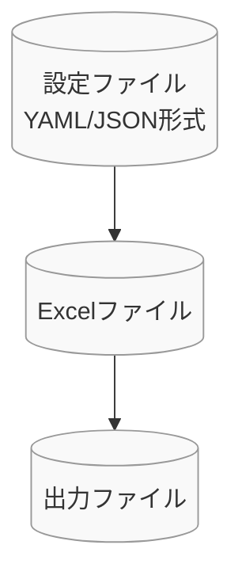
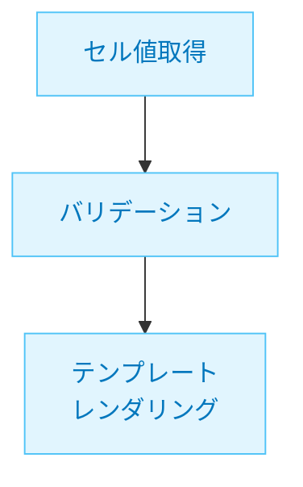
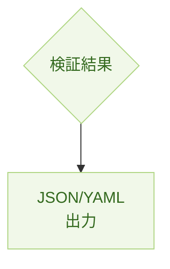
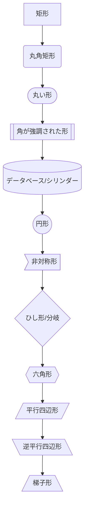
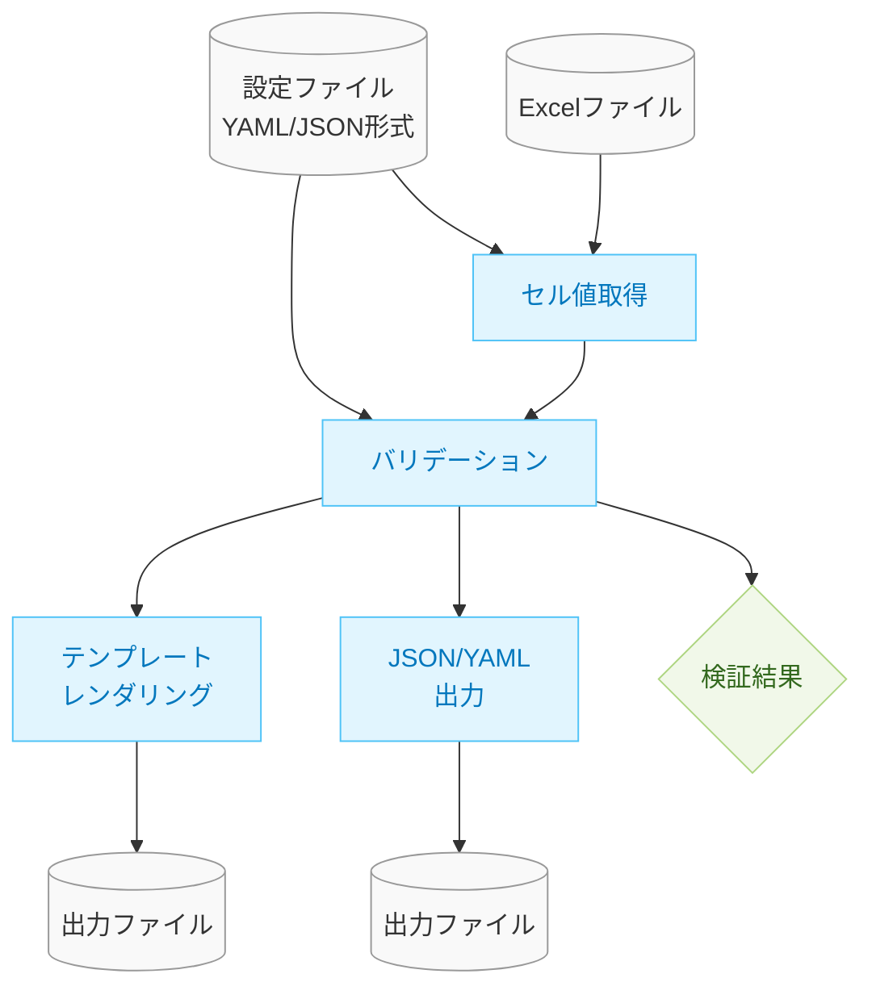

# Mermaidスタイルガイド

## 1. 概要

このドキュメントでは、xlsx-value-pickerプロジェクトのドキュメント内で使用するMermaid図表のスタイリングガイドラインを定義します。図表は視覚的な情報伝達において重要な役割を果たすため、一貫性のあるスタイルとアイコンを使用することで、ドキュメント全体の理解しやすさを向上させます。

## 2. 要素の分類とスタイル

Mermaidの図表では、主に以下の種類の要素を区別します：

### 2.1 ファイル・データ要素

ファイルやデータを表す要素には、以下のスタイルを適用します：

### 2.2 処理コンポーネント要素

処理やロジックを表すコンポーネントには、以下のスタイルを適用します：

### 2.3 結果・出力要素

結果や出力を表す要素には、以下のスタイルを適用します：

## 3. 形状オプション

Mermaidでは、様々な形状を使用して要素の種類を視覚的に区別することが可能です：

## 4. バリデーション機能のアーキテクチャ図用スタイル

バリデーション機能のアーキテクチャ図には、以下のスタイルを適用します：

### 4.1 要素の分類

- **ファイル・データ要素**: 設定ファイル、Excelファイル、出力ファイル
- **処理コンポーネント要素**: セル値取得、バリデーション、テンプレートレンダリング、JSON/YAML出力
- **結果要素**: 検証結果

### 4.2 改善例

## 5. 適用のガイドライン

1. **一貫性を保つ**: すべての図表で同じスタイル規則を適用する
2. **シンプルさを維持**: 過度な装飾は避け、情報伝達を優先する
3. **色とアイコンの意味**: 色やアイコンには一貫した意味を持たせる
   - シリンダー形状`[(名前)]`: ファイル・データ
   - 四角形`[名前]`: 処理コンポーネント
   - ひし形`{名前}`: 結果・判断

## 6. Mermaidにおける注意点

1. **改行の扱い**: テキスト内の改行は`\n`ではなく、` `タグを使用する
2. **形状指定**: 形状は`shape:cylinder`のようなスタイル指定ではなく、`[(`と`)]`のような記法で指定する
3. **スタイルプロパティ**: classDefで使用できるプロパティは限られており、形状は直接的には指定できない

## 7. 参考資料

- [Mermaid公式ドキュメント](https://mermaid-js.github.io/mermaid/#/)
- [Mermaidフローチャート構文](https://mermaid-js.github.io/mermaid/#/flowchart)
- [MermaidスタイルとクラスJS](https://mermaid-js.github.io/mermaid/#/flowchart?id=styling-and-classes)

---

このドキュメントは、プロジェクト内の図表の視覚的一貫性を確保するためのガイドラインです。必要に応じて随時更新していきます。