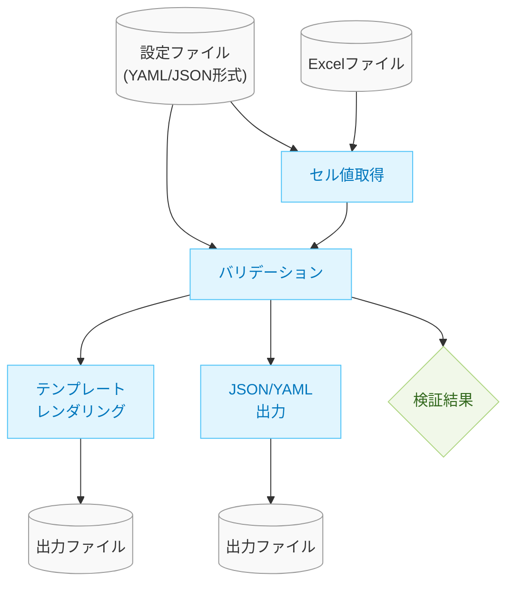

# Mermaid図表の構文エラー修正

## 1. 発生している問題

現在、`validation-design.md`および`mermaid-style-guide.md`内のMermaid図表において、以下のようなエラーが発生しています。

```
Parse error on line 5:
...    config[(設定ファイル\n(YAML/JSON形式))]:::fi
-----------------------^
Expecting 'SQE', 'DOUBLECIRCLEEND', 'PE', '-)', 'STADIUMEND', 'SUBROUTINEEND', 'PIPE', 'CYLINDEREND', 'DIAMOND_STOP', 'TAGEND', 'TRAPEND', 'INVTRAPEND', 'UNICODE_TEXT', 'TEXT', 'TAGSTART', got 'PS'
```

このエラーは、Mermaidの構文で特にノード形状の指定方法に問題があることを示唆しています。

## 2. エラーの原因

エラーの主な原因は以下の点にあると考えられます：

1. シリンダー形状の指定方法が正しくない
2. `shape:cylinder`のような直接的なスタイル指定はclassDefでサポートされていない
3. 改行文字`\n`の扱いに問題がある可能性

## 3. 修正方針

Mermaidでは、ノードの形状はクラス定義ではなく、ノード定義の構文自体で指定する必要があります。以下の修正方針で対応します：

1. **シリンダー形状の正しい指定方法** - Mermaidでシリンダー形状は`[(テキスト)]`ではなく、`[(テキスト)]`または`[("テキスト")]`のように指定
2. **クラス定義の修正** - `shape`プロパティを使わず、色や線のスタイルのみを定義
3. **改行の扱い** - テキスト内の改行を`<br>`タグで代替

## 4. 修正例



## 5. 実施する修正

1. `mermaid-style-guide.md`のサンプル図を修正
2. `validation-design.md`の全体アーキテクチャ図を修正
3. 修正後の図をプレビューして確認

上記修正を行うことで、Mermaid図表の構文エラーを解消し、正しく表示されるようにします。