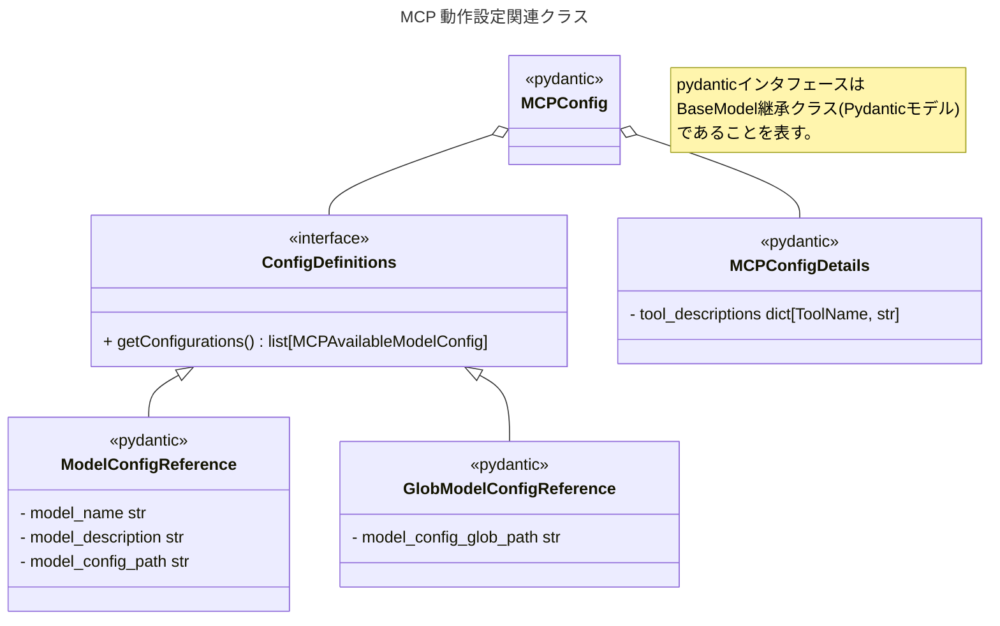

# MCPサーバー機能追加 計画 (PLANNING)

## 1. 目的

本ツールにModel Context Protocol (MCP) サーバーとしての機能を追加し、外部のMCPクライアント（例: VS Code拡張機能など）から本ツールの機能を利用できるようにする。これにより、ツールの利用シーン拡大と他の開発ツールとの連携強化を目指す。

特に、「Excelファイルの内容を適切に構造化したテキストとして生成AIに受け渡すことにより、既存Excelファイルの内容を正確に活用する」ことを主要な目的とし、生成AIを活用したワークフローの効率化を図る。

## 2. 背景

現在、本ツールはコマンドラインインターフェース (CLI) として提供されている。MCPサーバー機能を追加することで、GUIクライアントや他の自動化ツール、特に生成AI関連のツールからの利用が容易になり、開発・業務ワークフローへの統合が促進される。

## 3. 機能要件

### 3.1 技術選定要件

- **バックエンド方式**: MCPサーバーは**stdio（標準入出力）をバックエンド**としたもののみを対象とする。これは本プロジェクトが扱う対象がローカルリソースのみであり、SSE（Server Sent Event）をバックエンドとしたMCPサーバーは過剰であるためである。

### 3.2 コア機能要件

用語の定義:
- モデル: 設定ファイルに基づくExcelファイル処理の設定を指す。具体的には、Excelファイルのパス、シート名、抽出/バリデーションルール、出力形式などを含む、既存機能が定義する情報である。
- MCP動作設定ファイル: MCPサーバーの動作に必要な設定を指す。具体的には、MCPサーバーの起動時に読み込むモデル設定ファイル(複数の可能性あり)のパスや、MCPサーバが提供する補助情報(MCPサーバが提供する各ツールの説明文など)の設定を含む。

-   **サーバー起動**: サブコマンド`mcp`によりMCPサーバーとして起動できる。
-   **設定連携**: MCP動作設定ファイルに基づき、設定ファイルを複数読み込み、利用可能なモデル一覧としてサーバーの動作に反映する。
-   **モデルリスト提供 (`listModels`)**: 設定ファイルに基づき、利用可能な「モデル」（Excelファイル処理設定に対応）のリストを提供する。
-   **モデル情報提供 (`getModelInfo`)**: 指定されたモデルに関する詳細情報（設定内容、対象ファイルなど）を提供する。
-   **バリデーション結果提供 (`getDiagnostics`)**: 設定ファイルや対象Excelファイルに対するバリデーション結果をMCPクライアントに通知する。
-   **ファイル内容の構造化テキスト提供 (`getFileContent`)**: 指定されたモデルに基づいて、Excelファイルの内容を構造化されたテキスト（JSON、YAML、Markdown等）として提供する。特に、バリデーションを通過したモデルによる出力のみを生成AIに提供することで、精度の高い情報活用を可能にする。
-   **エラーハンドリング**: MCP仕様に準拠したエラー通知を行う。既存の例外クラスをMCPプロトコルのエラーレスポンスに適切にマッピングする。

    ```python
    # エラーマッピングの例
    MCP_ERROR_MAPPING = {
        ConfigLoadError: {"code": -32803, "message": "設定ファイルの読み込みエラー"},
        ConfigValidationError: {"code": -32804, "message": "設定ファイルの検証エラー"},
        ExcelProcessingError: {"code": -32805, "message": "Excelファイル処理エラー"},
        # その他のエラー
    }
    ```
-   **ロギング**: サーバーの動作状況やエラー情報を記録する。

### 3.3 生成AI連携機能要件

- **バリデーション統合**: モデル選択の負担を軽減するため、バリデーションを通過したモデルによる出力のみを生成AIに提供する仕組みを実装する。これにより、ユーザーや生成AIが過剰にモデル選択を気にする必要を軽減する。

## 4. 設計方針

-   **ライブラリ選定**: MCPサーバー機能の実装には、公式の **MCP Python SDK (`mcp`)** を採用する。このSDKはMCPプロトコルの実装を提供し、サーバーおよびクライアント機能を含むため、開発効率とプロトコル準拠性を高めることができる。
-   **通信バックエンド**: stdio（標準入出力）をバックエンドとして利用し、簡素でロバストな実装を目指す。
-   **既存機能活用**: 既存の `config_loader`, `excel_processor`, `validation` モジュールの機能を再利用しつつ、適切な実装のためのコード再配置などのリファクタリングを行う。
-   **設定ファイル構造**: 複数の「モデル」（Excelファイル処理設定）を管理するため、MCP動作設定ファイル(デフォルトファイル名 `mcp.yaml`)を新設する。トップレベルに `models` キーを設け、その下に配列形式で各モデルの設定（モデル名称, モデル設定ファイルパス, モデル説明文など）を定義する。また、MCPサーバ機能全体にかかわる設定を、トップレベルに `config` キーを設けて定義する。

    ```yaml
    # config.yaml (例)
    models:
      - model_name: model1
        config: ./model1.yaml
        description: "Model 1 description"
      - model_name: model2
        config: ./model2.yaml
        description: "Model 2 description"
    config:
        tool_descriptions:
            listModels: "List available models"
            getModelInfo: "Get model information"
            getDiagnostics: "Get validation results"
            getFileContent: "Get structured text from Excel file"
        # その他の動作設定(候補を要検討)
    ```
### **現在の課題**
- **テスト失敗**: `test/test_config_loader.py` のテストケースで以下の問題が発生。
  - **Invalid YAML/JSON Parsing**: 不正なYAML/JSONファイルのパースに失敗。
  - **Nonexistent Files**: 存在しないファイルに対するエラー処理。
  - **Unsupported Extensions**: サポートされていない拡張子のエラー処理。
  - **Assertion Failure**: `test_load_config_success` でのアサーションエラー。

### **次のステップ**
- **ConfigLoaderのデバッグ**: 上記の問題を解決するため、`ConfigLoader` の実装を見直し、エラーハンドリングを強化。
- **テストデータの確認**: テストデータが正しい形式であることを確認済み。
- **計画の更新**: MCPサーバー機能の実装に影響を与える可能性があるため、計画を調整。

    この変更に伴い、以下のPydanticモデルを新たに定義する：

    ```python
    class MCPConfig(BaseModel):
        models: list[ModelConfigReference | GlobModelConfigReference]
        config: MCPConfigDetails
        def configure(self) -> FastMCP:
            """設定内容に基づいてFastMCPサーバのインスタンスを構築して返す"""
            ... # サーバ設定処理
            return server
    
    class ModelConfigReference(BaseModel):
        """現行形式、あるいは新形式のモデル設定をそのまま参照する"""
        # 簡便にモデル設定ファイルを管理するため、相対パス表記の場合はMCP設定ファイルがあるディレクトリを基準とする。
        config_path: str = Field(..., alias="config")
        model_name: str | None = None # 新形式の場合は不要
        description: str | None = None # 新形式の場合は不要
    
    class GlobModelConfigReference(BaseModel):
        """
        所定のglobパターンにマッチするモデル設定を参照する. この設定により、複数のモデル設定ファイルを一括で指定できるが、現行形式のモデル設定ファイルでは不足するMCP動作向けの(モデル個別の)設定情報を各モデル設定ファイルに記載することを要求するため、現行形式のモデル設定に対応するPydanticモデルクラスの新形式のモデル設定クラスの新設が併せて必要である.
        """
        # ModelConfigReferenceと同様に、相対パス表記の場合はMCP設定ファイルがあるディレクトリを基準とする。
        config_path_pattern: str
    
    class MCPAvailableModelConfig(...): # 現行形式のモデル設定を継承して拡張することを想定
        # 既存のモデル設定に対応するクラスを継承し、必要なフィールドを追加する。
        model_name: str
        description: str
    
    type ToolName = Literal[
        "listModels",
        "getModelInfo",
        "getDiagnostics",
        "getFileContent"
    ]
    class MCPConfigDetails(BaseModel):
        tool_descriptions: dict[ToolName, str]
        # その他の設定項目を追加
    ```


<!-- 以降記載見直し中. 現時点では未確定のドラフトとして扱う. -->
-   **アーキテクチャ**:
    -   `src/xlsx_value_picker/mcp/` ディレクトリを新設し、サーバー関連のコードを格納する。
    -   `server.py`: サーバーの起動、`mcp` のサーバーインスタンス初期化、リクエストハンドラーの登録を行う。
    -   `handlers.py`: 各MCPリクエスト (`listModels`, `getModelInfo`, `getFileContent`, `getDiagnostics`) に対応するハンドラー関数を実装する。
    -   `protocol.py`: MCP固有のデータ構造（モデル情報、リクエスト/レスポンスパラメータなど）をPydanticモデルで定義する（`mcp` が提供する型も活用）。
-   **エントリーポイント**: CLIに `server` サブコマンドを追加し、`xlsx-value-picker server` コマンドでサーバーを起動できるようにする。
-   **モデル概念**: 設定ファイル (`config.yaml`) 内の `models` 辞書の各エントリ（キーがモデルID、値がモデル設定）をMCPにおける「モデル」として扱う。

-   **バリデーション連携**: 既存のバリデーション機能と連携し、`getDiagnostics` でバリデーション結果を提供し、`getFileContent` ではバリデーション通過状況を考慮した出力を行う。

## 5. 実装タスク

1.  **依存関係追加**: `uv add mcp[cli]` を実行する。(`pyproject.toml` に **`mcp`** を追加)
2.  **設定ファイル構造変更**:
    - `src/xlsx_value_picker/config_loader.py` のPydanticモデルを修正し、提案された複数モデル対応構造（`MCPConfig`など）を実装する。
    - `load_config` 関数を修正し、新しい構造のYAMLファイルを読み込めるようにする。
    - 既存のテスト (`test/test_config_loader.py`) を修正し、新しい設定構造に対応させる。
    - `test/data/config.yaml` を新しい構造に合わせて更新する。
3.  **ディレクトリ/ファイル作成**: `src/xlsx_value_picker/mcp_server/` ディレクトリと、その配下に `__init__.py`, `server.py`, `handlers.py`, `protocol.py` を作成する。
4.  **CLIサブコマンド追加**: `src/xlsx_value_picker/cli.py` を修正し、`server` サブコマンドを追加する。このサブコマンドは `mcp_server.server` モジュールの起動関数を呼び出す。
5.  **サーバー基盤実装 (`server.py`)**: **`mcp`** を用いて基本的なサーバープロセスを実装し、stdioを介してリクエストを待ち受ける処理を記述する。MCPConfigクラスから生成したFastMCPインスタンスをもとに以下のように起動することを検討する。

```python
from app.mcp import MCPConfig # パッケージの配置は要検討

# 引数はClickライブラリを用いて適切にパースおよびデフォルト値の設定を行う
def main(config_path: str = "config.yaml"):
    # JSONライブラリやPyYAMLライブラリなどから設定を読み込み、
    # MCPConfigインスタンスを生成
    raw_config_data = load_mcp_config(config_path)
    mcp_config = MCPConfig.validate_model(raw_config_data) 
    
    # サーバーの作成
    server = mcp_config.configure()
    server.run() # デフォルトでstdioトランスポートで起動するため特に引数の指定は不要。

if __name__ == "__main__":
    main()
```

1.  **MCPプロトコル定義 (`protocol.py`)**: 
    - `listModels`, `getModelInfo`, `getDiagnostics`, `getFileContent` で使用するリクエスト/レスポンスのパラメータ構造をPydanticモデルで定義する（`mcp` の型定義も活用）。
2.  **ハンドラー実装 (`handlers.py`)**:
    -   `handle_list_models`: 読み込んだ `AppConfig` からモデルIDのリストを生成して返す。
    -   `handle_get_model_info`: 指定されたモデルIDに対応する `ModelConfig` 情報を返す。
    -   `handle_get_diagnostics`: 指定されたモデルIDに対応する設定とExcelファイルに対して `validation` モジュールを実行し、結果を返す。
    -   `handle_get_file_content`: 指定されたモデルIDに基づき、`excel_processor` を実行して構造化テキストを生成して返す。バリデーション結果を考慮し、問題がある場合は適切なエラーを返す。
3.  **ハンドラー登録 (`server.py`)**: 実装したハンドラー関数を **`mcp`** のサーバーインスタンスに登録する。
4.  **ロギング設定**: Python標準の `logging` モジュールを設定し、サーバーの動作ログを標準エラー出力などに出力するようにする。
5.  **テストコード作成**:
    -   `test/test_mcp_server.py` を作成し、各ハンドラーのユニットテストを実装する。モックを使用して依存コンポーネント（`config_loader`, `excel_processor`, `validation` など）を分離する。
    -   **`mcp` のクライアント機能** を利用して、stdio を介したMCP通信の結合テストを実装する。これにより、JSON-RPCレベルの詳細を意識せず、MCPプロトコルレベルでのテストを簡潔に記述する。
6.  **テスト実行**: `pytest` を実行し、新規追加分を含むすべてのテストが成功することを確認する。
7.  **生成AI連携検証**: 主要な生成AIプラットフォーム（またはMCPクライアント）との連携動作を検証し、必要に応じて出力形式やプロトコル実装を調整する。

## 6. 既存文書の改訂方針

以下のドキュメントについて、MCPサーバー機能の追加に伴う改訂を行う。

-   **`docs/README.md`**:
    -   「機能」セクションにMCPサーバー機能を追加。
    -   「使い方」セクションに `server` サブコマンドによる起動方法と基本的な利用例を追加。
-   **`docs/project-status.md`**:
    -   「MCPサーバー機能」の項目を追加し、進捗ステータスを管理する。
-   **`docs/design/`**:
    -   `mcp-server-design.md` を新規作成し、本計画の「4. 設計方針」および「5. 実装タスク」で検討した内容を基に、より詳細な設計（クラス図、シーケンス図、API詳細など）を記述する。
-   **`docs/project/requirements.md`**:
    -   MCPサーバー機能に関する要件（機能要件、非機能要件）を追記する。
-   **`docs/project/technology-selection.md`**:
    -   MCPサーバー実装のために **`mcp`** を採用した理由や、関連する技術要素について追記する。
-   **`docs/spec/cli-spec.md`**:
    -   `server` サブコマンドの仕様（引数、オプション、動作）を詳細に記述する。
-   **`docs/guide/directory-structure-guideline.md`**:
    -   `src/xlsx_value_picker/mcp_server/` ディレクトリ構造と各ファイルの役割について追記する。
-   **`docs/task_log/`**:
    -   本計画ファイル (`PLANNING_add-mcp-server-feature.md`) を配置する。

## 7. テスト方針

-   **ユニットテスト**: `pytest` と `unittest.mock` を使用し、各ハンドラー関数やサーバーのコアロジックを個別にテストする。既存モジュールへの依存はモックで代替する。
-   **結合テスト**: **`mcp` のクライアント機能** を活用し、stdio を介してサーバープロセスとMCPメッセージを送受信し、プロトコルレベルでの動作を検証するテストを実装する。
-   **テストカバレッジ**: 新規コードに対するテストカバレッジを計測し、十分な網羅率を目指す。
-   **CI連携**: CIパイプラインで全てのテストが自動実行されるように設定する。
-   **MCPクライアントモックの活用**: テスト時には以下のようなMCPクライアントモックを使用して効率的にテストを行う。

    ```python
    # MCPクライアントモックの例
    class MockMCPClient:
        def __init__(self, server_process):
            self.server_process = server_process
            self.stdin = server_process.stdin
            self.stdout = server_process.stdout
            self.request_id = 0
        
        def send_request(self, method, params=None):
            self.request_id += 1
            request = {
                "jsonrpc": "2.0",
                "id": self.request_id,
                "method": method,
                "params": params or {}
            }
            
            # リクエスト送信
            self.stdin.write(json.dumps(request).encode() + b"\n")
            self.stdin.flush()
            
            # レスポンス受信
            response_line = self.stdout.readline()
            return json.loads(response_line.decode())
    ```

## 8. 成果物

-   MCPサーバー機能の実装コード (`src/xlsx_value_picker/mcp_server/` 以下)
-   MCPサーバー機能のテストコード (`test/test_mcp_server.py` など)
-   改訂された各種ドキュメント (`docs/` 配下)
-   更新された `pyproject.toml` および `uv.lock`
-   本計画書 (`docs/task_log/PLANNING_add-mcp-server-feature.md`)

## 9. リスクと課題

-   **`mcp`パッケージ の理解不足**: SDKの利用経験や習熟度によっては、実装やデバッグに時間を要する可能性がある。SDKのドキュメントやサンプルコード、およびパッケージ内の実装そのものを参照することで、理解を深める必要がある。
-   **`mcp` の成熟度**: MCP Python SDK は比較的新しいライブラリである可能性があり、ドキュメントの不足、バグ、仕様変更などのリスクが考えられる。
-   **MCP仕様の解釈**: MCPプロトコル自体の解釈やクライアント実装との互換性に注意が必要となる可能性がある。
-   **生成AI連携の精度**: 生成AIに提供する構造化テキストの形式によっては、AIが正確に情報を理解できない可能性がある。出力形式の最適化が必要となる。
-   **バリデーションの厳格さ**: バリデーションが厳格すぎると利用可能なモデルが少なくなり、柔軟性が失われる可能性がある。適切なバランス調整が必要。
-   **設定ファイル構造変更の影響**: 既存のCLI機能 (`run` コマンドなど) が新しい設定ファイル構造に依存する場合、それらの機能への影響調査と修正が必要になる可能性がある。（今回のスコープではMCPサーバー機能に限定するが、将来的な課題として認識）
-   **セキュリティ考慮事項（将来的な改善事項）**: ローカル実行が前提であっても、将来的にはファイルパスのバリデーション（ディレクトリトラバーサル攻撃の防止）や機密情報（パスワード保護されたExcelファイルなど）の扱いについて考慮する必要がある。
-   **大規模Excelファイル処理の最適化（将来的な改善事項）**: 大きなExcelファイルを効率的に処理するための方法（必要に応じた部分的な読み込みなど）やメモリ使用量の最適化について検討する必要がある。

## 10. 今後のステップ

1.  本計画書の内容についてユーザーレビューを受け、承認を得る。
2.  承認後、ファイル名を `WIP_add-mcp-server-feature.md` に変更し、実装タスクを開始する。
3.  実装とテストが完了したら、ユーザーに完了報告を行い、承認を得る。
4.  承認後、作業内容のサマリを追記し、ファイル名を `DONE_add-mcp-server-feature.md` に変更する。