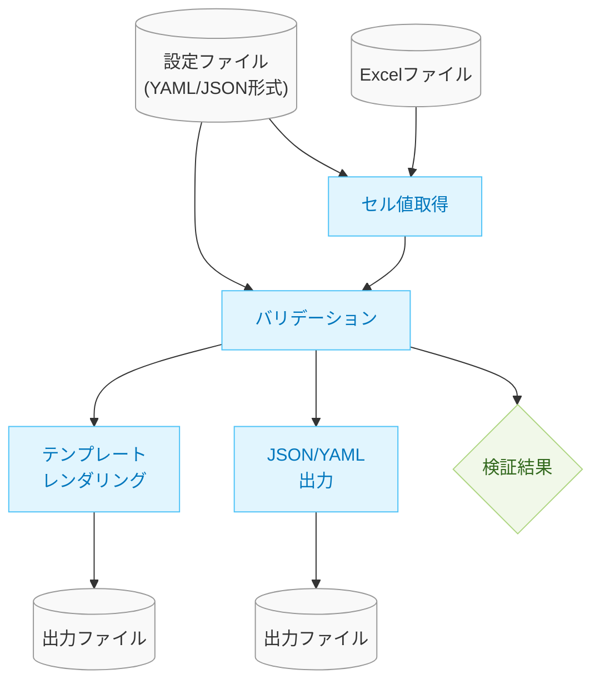

# バリデーションエンジンの設計ドキュメント

## 1. 概要

このドキュメントでは、xlsx-value-pickerプロジェクトにおけるバリデーション機能の設計について詳述します。バリデーション機能は、Excelファイル内のデータが特定のルールに合致しているかを検証し、問題があれば適切なエラーメッセージを返すことを目的としています。

## 2. バリデーション機能の全体アーキテクチャ

バリデーション機能は以下のコンポーネントで構成されます：



上記の図に示すように、設定ファイルはバリデーションルールの定義だけでなく、セル値取得のための参照先定義（フィールドとセル位置のマッピングなど）も含んでいるため、セル値取得コンポーネントへの入力としても機能します。

## 3. バリデーションルールの内部表現

### 3.1 ルール定義の基本構造

バリデーションルールはPythonのクラス階層として実装します。基本となるルールインターフェースと、それを実装する各種ルールクラスを定義します。

```python
from abc import ABC, abstractmethod
from dataclasses import dataclass
from typing import Any, Dict, List, Optional

@dataclass
class ValidationContext:
    """バリデーション実行時のコンテキスト情報"""
    cell_values: Dict[str, Any]  # フィールド名とその値のマッピング
    field_locations: Dict[str, str]  # フィールド名とセル位置のマッピング

@dataclass
class ValidationResult:
    """バリデーション結果"""
    is_valid: bool
    error_message: Optional[str] = None
    error_fields: List[str] = None

class Rule(ABC):
    """すべてのルールの基底クラス"""
    
    @abstractmethod
    def validate(self, context: ValidationContext) -> ValidationResult:
        """ルールの検証を行い結果を返す"""
        pass
```

### 3.2 各種ルールの実装

各種ルールは以下のように定義します：

```python
@dataclass
class CompareRule(Rule):
    """値の比較を行うルール"""
    left: str
    operator: str  # "==", "!=", ">", ">=", "<", "<="
    right: Any
    error_message: str

    def validate(self, context: ValidationContext) -> ValidationResult:
        # 実装省略
        pass

@dataclass
class RequiredRule(Rule):
    """必須項目を検証するルール"""
    field: str
    error_message: str

    def validate(self, context: ValidationContext) -> ValidationResult:
        # 実装省略
        pass

@dataclass
class AnyOfRule(Rule):
    """いずれかのルールが成立するかを検証するルール"""
    rules: List[Rule]
    error_message: str

    def validate(self, context: ValidationContext) -> ValidationResult:
        # 実装省略
        pass

# その他のルールクラスも同様に定義
```

## 4. ルール定義のパース処理

設定ファイル（YAML/JSON）からルールオブジェクトへの変換を行うパーサーを実装します。

### 4.1 ルール定義スキーマ

```yaml
# 設定ファイル構造の例
fields:  # セル値取得のためのマッピング定義
  animal_select: Sheet1!B5
  animal_free_text: Sheet1!D5
  email: Sheet1!E5
  product_code: Sheet2!A1
  quantity: Sheet2!B1

rules:  # バリデーションルール定義
  - name: "その他選択時の自由記入必須"
    expression:
      any_of:
        - compare:
            left: "animal_select"
            operator: "!="
            right: "その他"
        - field:
            name: "animal_free_text"
            required: true
    error_message: "「その他」を選んだ場合は内容を記入してください。"

output:  # 出力設定
  format: "json"  # "json", "yaml", "jinja2"
  template_file: "template.j2"  # テンプレート使用時のファイルパス
```

### 4.2 パーサーの実装方針

1. YAMLファイルを読み込む
2. スキーマに従って各ルールを適切なルールオブジェクトに変換
3. 複合ルール（any_of, all_ofなど）は再帰的に処理

```python
def parse_rule(rule_def: Dict[str, Any]) -> Rule:
    """
    ルール定義からRuleオブジェクトを作成
    """
    expr = rule_def["expression"]
    error_message = rule_def.get("error_message", "検証エラーが発生しました")
    
    # 式タイプに応じて適切なルールを作成
    if "compare" in expr:
        compare_def = expr["compare"]
        return CompareRule(
            left=compare_def["left"],
            operator=compare_def["operator"],
            right=compare_def["right"],
            error_message=error_message
        )
    elif "field" in expr and expr["field"].get("required"):
        return RequiredRule(
            field=expr["field"]["name"],
            error_message=error_message
        )
    # 他のルールタイプも同様に処理
    
    raise ValueError(f"サポートされていない式タイプです: {expr}")
```

## 5. バリデーション実行エンジン

バリデーションエンジンは、以下の処理を行います：

1. Excelファイルからセル値を取得
2. バリデーションコンテキストを構築
3. 定義されたすべてのルールを評価
4. バリデーション結果を収集・整理

```python
@dataclass
class ValidationEngine:
    rules: List[Rule]
    
    def validate(self, excel_file: str, field_mapping: Dict[str, str]) -> List[ValidationResult]:
        # Excelから値を取得
        cell_values = get_excel_values(excel_file, field_mapping)
        
        # コンテキストを構築
        context = ValidationContext(
            cell_values=cell_values,
            field_locations=field_mapping
        )
        
        # すべてのルールを評価
        results = []
        for rule in self.rules:
            result = rule.validate(context)
            if not result.is_valid:
                results.append(result)
                
        return results
```

## 6. CLI統合

バリデーション機能をCLIに統合します。既存のCLIオプションに加えて、以下の機能を追加します：

- バリデーションのみを実行するオプション
- バリデーション結果の出力形式指定
- バリデーションエラー時の動作カスタマイズ

```python
def main() -> None:
    parser = argparse.ArgumentParser(description="Excel値取得ツール")
    # 既存のオプション
    parser.add_argument("excel", nargs="?", help="Excelファイルパス（コマンドライン優先）")
    parser.add_argument("-c", "--config", default="config.yaml", help="設定ファイルパス")
    parser.add_argument("-o", "--output", help="出力ファイルパス（未指定時は標準出力）")
    
    # 新規追加オプション
    parser.add_argument("--validate-only", action="store_true", help="バリデーションのみを実行")
    parser.add_argument("--ignore-errors", action="store_true", help="検証エラーが発生しても処理を継続")
    
    # 処理の実装
    # ...
```

## 7. エラーハンドリングと出力

バリデーションエラーは以下の情報を含みます：

- エラーメッセージ
- 対象のフィールド名
- セルの位置情報（シート名と座標）
- エラーの重要度（警告・エラーなど）

出力例：
```json
{
  "validation_results": [
    {
      "is_valid": false,
      "error_message": "「その他」を選んだ場合は内容を記入してください。",
      "error_fields": ["animal_free_text"],
      "error_locations": ["Sheet1!D5"],
      "severity": "error"
    },
    {
      "is_valid": false,
      "error_message": "メールアドレスの形式が正しくありません。",
      "error_fields": ["email"],
      "error_locations": ["Sheet1!E5"],
      "severity": "error"
    }
  ],
  "is_valid": false,
  "error_count": 2
}
```

## 8. テスト方針

バリデーション機能のテストは以下のアプローチで実施します：

1. **単体テスト**
   - 各ルールクラスの個別テスト
   - パーサーの動作検証
   - エラー出力形式の検証

2. **統合テスト**
   - 複合ルールの検証
   - 実際のExcelファイルを使用したE2Eテスト

3. **エッジケース**
   - 空のセル値
   - 型変換が必要なケース
   - 複雑な条件の組み合わせ

## 9. 実装ステップ

1. バリデーションルールの基本クラス階層の実装
2. 一般的なルール（Compare, Required）の実装
3. 複合ルール（AnyOf, AllOf, Not）の実装
4. 特殊ルール（RegexMatch, Enum）の実装
5. パーサーの実装
6. バリデーションエンジンの実装
7. CLIとの統合
8. テストの作成と実行
9. ドキュメント更新

## 10. 今後の拡張性

将来的には以下の拡張も検討します：

- カスタムルールの追加機能
- エラーメッセージのカスタマイズ
- 国際化対応（エラーメッセージの多言語化）
- GUIによるルール定義・編集機能

---

このドキュメントは実装を進める中で随時更新していきます。